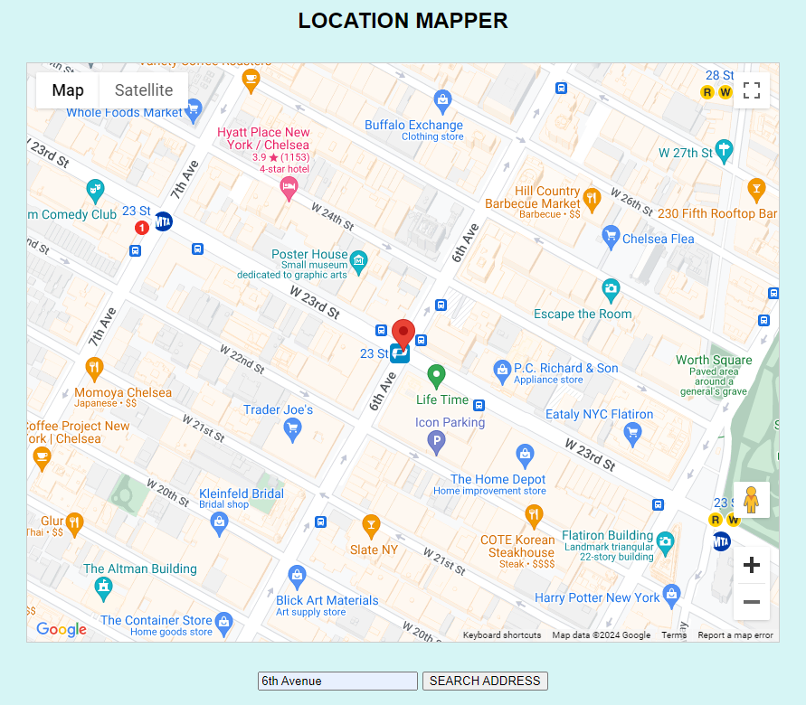

# Location Mapper Web App

This is a simple web application that allows users to search for a location by entering an address. The application then utilizes the Google Geocoding API to fetch the coordinates of the entered address and displays it on a map.

## Preview

## Getting Started

To use this web app, follow these steps:

1. Ensure you have an API key for the Google Geocoding API. If you don't have one, you can obtain it from the Google Cloud Platform Console.
2. Replace `YOURAPIKEY` in the script tag within the `index.html` file with your actual API key.
3. Save your actual API key in a configuration.js file
4. Open the `index.html` file in a web browser.

## Features

- **Address Search:** Users can enter an address into the input field and search for its location.
- **Dynamic Map:** The application dynamically displays the location on a map using the Google Maps API.
- **Error Handling:** If the entered address is not found or if there's an error in fetching the location, appropriate error messages are displayed.

## Technologies Used

- **HTML:** Provides the structure of the web page.
- **CSS:** Defines the styles for the web page elements.
- **TypeScript / Javascript:** Handles user interactions and fetches data from the Google Geocoding API.
- **Axios:** Used for making HTTP requests to the Google Geocoding API.
- **Google Maps API:** Renders the map and adds markers for the location.
- **Webpack:** Bundles the JavaScript files.

## Code Structure

- `index.html`: The main HTML file containing the structure of the web page.
- `app.css`: Stylesheet for the web page.
- `bundle.js`: JavaScript bundle file generated by Webpack.
- `config/config.js`: Configuration file containing the API key.
- `script.ts`: TypeScript file containing the logic for fetching and displaying the location.
- `webpack.config.js`: Configuration file for Webpack.

## Contributing

Contributions are welcome! If you find any issues or have suggestions for improvements, please feel free to open an issue or create a pull request.
